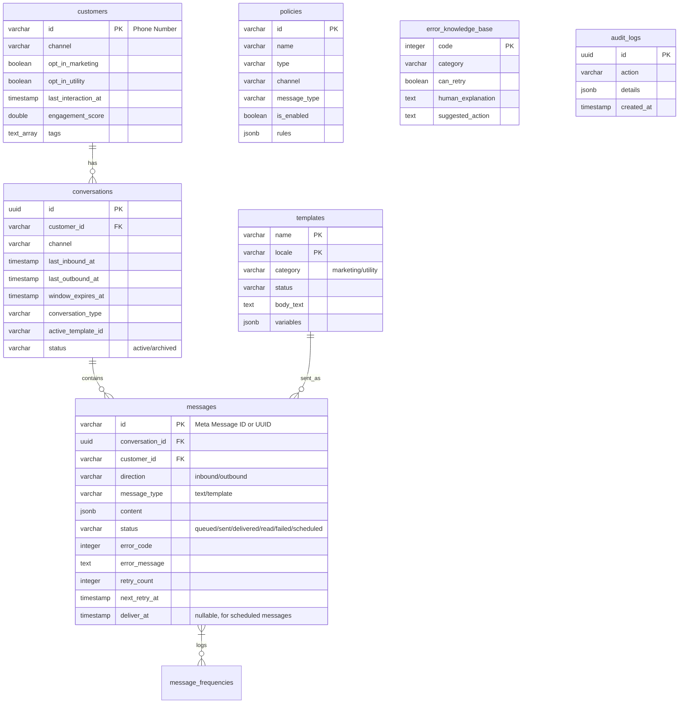

# Meta Business MCP

`Go 1.21+` `License: Apache 2.0` `Tests: Passing` `Coverage: 85.6%` `Tools: 24` `Production-Validated`

> A WhatsApp compliance intelligence platform that ensures every AI Agent can operate WhatsApp Business safely, compliantly, and production-ready — without understanding Meta's rule complexity.

**For:** AI Agent developers · Digital agencies · WhatsApp automation teams
**21 tools free forever · 3 campaign tools on Pro**

---

## Table of Contents

1. [Why This Exists](#why-this-exists)
2. [What It Does](#what-it-does)
3. [Quick Start](#quick-start)
4. [MCP Tools](#mcp-tools)
5. [Architecture](#architecture)
6. [Configuration](#configuration)
7. [Testing](#testing)
8. [Deployment](#deployment)
9. [Business Model](#business-model)
10. [Roadmap](#roadmap)
11. [Observability](#observability)
12. [Documentation Index](#documentation-index)
13. [Contributing](#contributing)
14. [License](#license)

---

## Why This Exists

AI Agents don't understand Meta's WhatsApp Business rules — 24-hour care windows, frequency caps, template categories, opt-out mandates, rate limits. Sending a single message wrong means account suspension, message rejection, and compliance violations. Meta Business MCP sits between the AI Agent and Meta's API, enforcing every rule automatically so the Agent never has to learn them.

---

## What It Does

| Responsibility | Description |
|---|---|
| **Compliance Gate** | Evaluates every outbound message against Meta's care window rules, opt-out lists, and frequency caps before delivery. |
| **Policy Enforcement** | Applies custom business policies (time boundaries, segment exclusions, VIP tag overrides) from a YAML-seeded database. |
| **Async Message Delivery** | Queues messages to NATS JetStream and dispatches them via a worker pool with automatic retries and exponential backoff. |
| **Rate Limiting** | Enforces per-customer token-bucket rate limits via Redis Lua scripts. |
| **Error Intelligence** | Translates numeric Meta API error codes into categorized, actionable developer instructions. |
| **Campaign Management** | Schedule, pause, cancel campaigns with audience segmentation and template validation. |
| **Template Lifecycle** | Create, sync, and validate templates via Meta API with local persistence. |
| **MCP Server** | Exposes 24 structured tools to AI Agents over stdio using the Model Context Protocol. |
| **Webhook Receiver** | Processes inbound events from Meta: customer messages, delivery status updates, and template approval callbacks. |

---

## Quick Start

### 1. Clone and Start

```bash
git clone https://github.com/metabusiness-mcp/meta-business-mcp.git
cd meta-business-mcp
docker compose up -d --build
```

Wait for all containers to become healthy:

```bash
docker compose ps
# All should show "healthy"
```

### 2. Access the Dashboard

Open your browser: **http://localhost:8080**

On first run, the server auto-generates a random password and prints it to the terminal:

```
╔══════════════════════════════════════════════════════════╗
║              DASHBOARD CREDENTIALS (auto-generated)      ║
╠══════════════════════════════════════════════════════════╣
║  Username: admin                                         ║
║  Password: a1b2c3d4e5f6g7h8                             ║
╚══════════════════════════════════════════════════════════╝
```

Copy the password and log in.

### 3. Connect Your AI Agent

The MCP server runs on stdio. Configure your AI client (Claude Desktop, Cursor, etc.):

```json
{
  "mcpServers": {
    "meta-business-mcp": {
      "command": "/path/to/meta-business-mcp",
      "args": []
    }
  }
}
```

### 4. Verify

```bash
curl http://localhost:8080/health
# OK
```

**What starts:** PostgreSQL 16 (`:5432`), Redis 7 (`:6379`), NATS JetStream (`:4222`), Mock Meta API (`:8081`), Meta Business MCP (`:8080` + MCP stdio). Mock credentials are used by default — no Meta API keys required for local development.

---

## MCP Tools

All 24 tools are exposed to AI Agents over stdio using the Model Context Protocol. All tools are production-ready and validated against real WABA production (Meta Graph API v20.0).

### Action Operations

| Tool | Description | Tier | Status |
|---|---|---|---|
| `check_compliance()` | Evaluate if a planned outbound message complies with Meta rules and local policies | [All] | ✅ |
| `send_message()` | Send free-form service text message (requires active 24h care window) | [All] | ✅ |
| `send_template()` | Send approved template message (bypasses 24h care window) | [All] | ✅ |
| `explain_error()` | Translate Meta API error code into categorized, actionable explanation | [All] | ✅ |
| `reply_customer()` | Reply within an active conversation context (requires open 24h window) | [All] | ✅ |
| `retry_failed_messages()` | Trigger manual retry for one or more failed messages with retryability validation | [All] | ✅ |
| `sync_template_status()` | Sync template approval status from Meta API and update local database | [All] | ✅ |

### Read-Only Intelligence

| Tool | Description | Tier | Status |
|---|---|---|---|
| `check_conversation()` | Query conversation window status, time remaining, type, and eligibility | [All] | ✅ |
| `check_frequency_cap()` | Check if a customer is under Meta's frequency cap for marketing messages | [All] | ✅ |
| `get_customer_context()` | Retrieve full customer profile: opt-in/out, tags, engagement score, eligibility | [All] | ✅ |
| `get_delivery_status()` | Query message delivery status (sent/delivered/read/failed) with error intelligence | [All] | ✅ |
| `get_rate_limit()` | Query current MPS capacity, tokens consumed, and tokens remaining | [All] | ✅ |
| `list_conversations()` | List conversations with filters: open, closed, expiring_soon | [All] | ✅ |
| `list_templates()` | List templates with status/category/locale filters from Meta API | [All] | ✅ |

### Scheduling & Campaign

| Tool | Description | Tier | Status |
|---|---|---|---|
| `schedule_message()` | Schedule single message for future delivery with compliance pre-check | [All] | ✅ |
| `schedule_campaign()` | Schedule broadcast campaign with approved template and audience filter | [Pro] | ✅ |
| `cancel_campaign()` | Cancel campaign in non-terminal state (scheduled/running/paused) | [Pro] | ✅ |
| `pause_campaign()` | Pause active campaign, preserving progress counters for resume | [Pro] | ✅ |

### Account & Cost Intelligence

| Tool | Description | Tier | Status |
|---|---|---|---|
| `get_account_quality()` | Retrieve WABA quality score and messaging limit tier from Meta | [All] | ✅ |
| `estimate_cost()` | Estimate conversation cost for a planned message batch | [All] | ✅ |
| `estimate_pricing()` | Query current conversation pricing tier for country/type combination | [All] | ✅ |

### Operational

| Tool | Description | Tier | Status |
|---|---|---|---|
| `create_template()` | Submit new template to Meta for approval, persist locally as PENDING | [All] | ✅ |
| `sync_webhooks()` | Trigger manual re-sync of template statuses and pending webhook events | [All] | ✅ |
| `archive_chat()` | Archive conversation in terminal state (expired window) | [All] | ✅ |

Full parameter specifications and response examples: [docs/api_reference.md](docs/api_reference.md)

---

## Architecture

### Dual-Mode Binary

The platform compiles to a single Go binary that runs two servers concurrently:

| Mode | Transport | Purpose |
|---|---|---|
| **MCP Server** | stdio (stdin/stdout) | Exposes 24 structured tools to AI clients (Gemini, Claude, Cursor) |
| **HTTP Server** | TCP :8080 | Webhook receiver, health checks, Prometheus metrics |

### High-Level Component Diagram

```
                      ┌───────────────────────────────┐
                      │           AI Agent            │
                      └──────────────┬────────────────┘
                                     │ Stdio (MCP Protocol)
                                     ▼
   ┌────────────────────────────────────────────────────────┐
   │                   Meta Business MCP                    │
   │                                                        │
   │   ┌───────────────────┐        ┌───────────────────┐   │
   │   │    MCP Server     ├───────►│ Compliance Engine │   │
   │   └───────────────────┘        └─────────┬─────────┘   │
   │                                          ▼             │
   │   ┌───────────────────┐        ┌───────────────────┐   │
   │   │ Webhook Receiver  │        │   Policy Engine   │   │
   │   └─────────▲─────────┘        └─────────┬─────────┘   │
   │             │                            ▼             │
   │             │                  ┌───────────────────┐   │
   │             │                  │    Orchestrator   │   │
   │             │                  └─────────┬─────────┘   │
   └─────────────┼────────────────────────────┼─────────────┘
                 │ Webhook                    │ POST /messages
                 │                            ▼
   ┌─────────────┴────────────────────────────┴─────────────┐
   │              Meta Cloud API (or Mock :8081)            │
   └────────────────────────────────────────────────────────┘
```

### Core Services

| Service | Package | Role |
|---|---|---|
| **MCP Server** | `pkg/mcp/` | Registers and handles 24 MCP tool calls from AI Agents. Split into 6 handler files (~2,000 lines). |
| **Compliance Engine** | `pkg/compliance/` | Enforces the 24h care window, opt-out/opt-in state, and frequency caps. |
| **Policy Engine** | `pkg/policy/` | Evaluates dynamic business rules (time limits, tag exclusions) from the DB. |
| **Conversation State Engine** | `pkg/state/` | Manages care window TTL with Redis caching and PostgreSQL fallback. |
| **User Intelligence** | `pkg/userintel/` | Tracks opt-ins, tags (e.g. `vip`), and interaction timelines. |
| **Template Manager** | `pkg/template/` | Syncs approved templates from Meta, validates variables, caches locally. |
| **Delivery Orchestrator** | `pkg/delivery/` | Enqueues messages to NATS JetStream; manages the background worker pool. |
| **Scheduler** | `pkg/delivery/` | In-process poll-based scheduler for scheduled messages and campaigns. |
| **Rate Limiter** | `pkg/ratelimit/` | Per-customer token bucket rate limits via Redis Lua scripts. |
| **Error Intelligence** | `pkg/errorintel/` | Maps Meta error codes to retry/no-retry classifications and explanations. |
| **Campaign Module** | `pkg/campaign/` | Campaign schema, audience filters, and tier-gated operations. |
| **Webhook Receiver** | `pkg/webhook/` | Parses and dispatches inbound Meta events (messages, status, templates). |
| **Observability** | `pkg/observability/` | Custom Prometheus metrics. |

### Persistence Layers

| Layer | Technology | Usage |
|---|---|---|
| **Primary DB** | PostgreSQL 16 (`pgxpool`) | All persistent data: conversations, messages, customers, templates, policies, campaigns, audit logs. |
| **Cache** | Redis 7 | Care window TTL state; token-bucket counters via Lua scripts; graceful PG fallback. |
| **Message Broker** | NATS JetStream | Async delivery queue with WorkQueue retention and pull consumers. |

### Database Schema (ER Diagram)



### NATS JetStream Queue Topology

| Stream | Subjects | Consumer | Max Deliver | Ack Wait | Backoff |
|---|---|---|---|---|---|
| `META_MCP_DELIVERY` | `whatsapp.messages.outbound`, `whatsapp.messages.retry` | `delivery-workers` (durable pull) | 3 | 30s | 1s → 5s (`NakWithDelay`) |
| `META_MCP_CAMPAIGN` | `whatsapp.campaigns.trigger` | `campaign-workers` | — | — | — |

### Redis Caching Strategy

- **Cache Key Pattern**: `conv:<customer_id>:<channel>` (e.g. `conv:628119989630:whatsapp`)
- **TTL**: Dynamically set to the exact remaining duration of the 24-hour care window.
- **Graceful Fallback**: If Redis is offline, the state engine falls back to PostgreSQL without error — validated by failure simulation tests.
- **Phone Number Format**: Internal cache and DB store numbers **without** the leading `+` prefix. MCP tool boundaries normalize `+`-prefixed inputs.

> Channel-agnostic architecture. WhatsApp is the active channel. Messenger and Instagram are activation targets, not roadmap commitments.

Full architecture documentation: [docs/architecture.md](docs/architecture.md)

---

## Configuration

### Config File (`config.yaml`)

Place `config.yaml` in the project root for local development:

```yaml
server:
  http_port: 8080
  mcp_name: "meta-business-mcp"
  mcp_version: "1.0.0"

database:
  host: "localhost"
  port: 5432
  user: "postgres"
  password: "password"
  dbname: "meta_mcp"
  sslmode: "disable"

redis:
  addr: "localhost:6379"

nats:
  url: "nats://localhost:4222"

meta:
  api_url: "http://localhost:8081"   # Use mock server for offline dev
  phone_number_id: "mock-phone-id"
  waba_id: "mock-waba-id"
  access_token: "mock-access-token"
  webhook_verify_token: "mock-verify-token"

policies_path: "policies.yaml"
tier: "oss"                          # oss | pro | enterprise
```

### Environment Variables

All config values can be overridden with environment variables. Required values are marked with ✅.

| Variable | Default | Required | Description |
|---|---|---|---|
| `SERVER_HTTP_PORT` | `8080` | — | HTTP server port |
| `SERVER_MCP_NAME` | `"meta-business-mcp"` | — | MCP server identifier |
| `SERVER_MCP_VERSION` | `"1.0.0"` | — | MCP server version string |
| `DB_HOST` | `"localhost"` | — | PostgreSQL host |
| `DB_PORT` | `5432` | — | PostgreSQL port |
| `DB_USER` | `"postgres"` | — | PostgreSQL username |
| `DB_PASSWORD` | `"password"` | — | PostgreSQL password |
| `DB_NAME` | `"meta_mcp"` | — | PostgreSQL database name |
| `DB_SSLMODE` | `"disable"` | — | `disable`, `require`, or `verify-ca` |
| `REDIS_ADDR` | `"localhost:6379"` | — | Redis connection address |
| `REDIS_PASSWORD` | `""` | — | Redis auth password |
| `REDIS_DB` | `0` | — | Redis database index |
| `NATS_URL` | `"nats://localhost:4222"` | — | NATS connection URL |
| `META_API_URL` | `"https://graph.facebook.com"` | — | Meta Graph API base URL |
| `META_ACCESS_TOKEN` | — | ✅ | Meta API OAuth token (system user) |
| `META_PHONE_NUMBER_ID` | — | ✅ | WhatsApp Business Phone Number ID |
| `META_WABA_ID` | — | ✅ | WhatsApp Business Account ID |
| `META_WEBHOOK_VERIFY_TOKEN` | — | ✅ | Meta webhook verification passphrase |
| `POLICIES_PATH` | `"policies.yaml"` | — | Path to the business policy seed YAML file |
| `TIER` | `"oss"` | — | Feature tier: `oss`, `pro`, or `enterprise` |
| `SCHEDULER_POLL_INTERVAL` | `"30s"` | — | Scheduler polling interval for scheduled messages/campaigns |

### Business Policies (`policies.yaml`)

Business policies are seeded from `policies.yaml` on startup and stored in the `policies` table. The seed script is idempotent (`ON CONFLICT DO UPDATE`), so restarting the app is sufficient to apply changes.

```yaml
- id: "no_marketing_after_8pm"
  name: "No marketing after 8pm"
  type: "time_restriction"
  channel: "whatsapp"
  message_type: "marketing"
  is_enabled: true
  rules:
    deny_after: "20:00"
    timezone: "Asia/Jakarta"
```

Full environment variable reference: [docs/env_variables.md](docs/env_variables.md)

---

## Testing

### Run All Tests

```bash
go test -count=1 -p 1 -cover ./...
```

### Run Compliance Benchmark

```bash
go test -bench=BenchmarkCheckCompliance -benchtime=5s ./pkg/compliance/
```

### Package Coverage (Sprint 2)

| Package | Coverage |
|---|---|
| `pkg/compliance` | 93.9% |
| `pkg/errorintel` | 100.0% |
| `pkg/config` | 96.2% |
| `pkg/observability` | 100.0% |
| `pkg/ratelimit` | 87.5% |
| `pkg/webhook` | 83.6% |
| `pkg/state` | 83.3% |
| `pkg/userintel` | 82.1% |
| `pkg/policy` | 79.5% |
| `pkg/template` | 78.9% |
| `pkg/campaign` | 77.1% |
| `pkg/delivery` | 73.8% |
| `pkg/mcp` | 61.6% |

### Test Suites

| Suite | File | Tests | Status |
|---|---|---|---|
| v1 Handlers | `pkg/mcp/server_test.go` | 5 (check_compliance, explain_error, send_message, send_template, phone normalization) | ✅ |
| Group A — Intelligence | `pkg/mcp/server_test.go` | 8 (check_conversation, check_frequency_cap, get_customer_context, get_delivery_status ×2, get_rate_limit, list_templates, list_conversations) | ✅ |
| Group B — Messaging | `pkg/mcp/server_test.go` | 5 (reply_customer ×2, retry_failed_messages ×2, sync_template_status) | ✅ |
| Group C — Campaign | `pkg/mcp/server_test.go` | 5 (schedule_message ×2, campaign tier-gating ×3) | ✅ |
| Group D — Account | `pkg/mcp/server_test.go` | 4 (estimate_cost, estimate_pricing, get_account_quality) | ✅ |
| Group E — Ops | `pkg/mcp/server_test.go` | 3 (archive_chat ×2, sync_webhooks) | ✅ |
| Scheduler | `pkg/delivery/scheduler_test.go` | 5 (due message, future message, compliance failure, duplicate dispatch, campaign trigger) | ✅ |
| Integration | `tests/integration_test.go` | 7 | ✅ |
| E2E | `tests/e2e_test.go` | 3 | ✅ |
| Failure Simulation | `tests/failure_test.go` | 4 (Redis outage, NATS outage, Meta 500, Meta 131049) | ✅ |

### Benchmark Result

| Tool | Latency | vs. Target |
|---|---|---|
| `check_compliance()` | **1.69 ms** | ~30× faster than 50ms target |

---

## Deployment

### Build the Binary

```bash
go build -o mcp-server ./cmd/server/main.go
```

### Production Environment (`.env`)

```env
SERVER_HTTP_PORT=8080
SERVER_MCP_NAME=meta-business-mcp
SERVER_MCP_VERSION=1.0.0
TIER=oss

DB_HOST=postgres.prod.internal
DB_PORT=5432
DB_USER=mcp_user
DB_PASSWORD=production_secure_postgres_pass
DB_NAME=meta_mcp
DB_SSLMODE=require

REDIS_ADDR=redis.prod.internal:6379
REDIS_PASSWORD=production_redis_auth_pass
REDIS_DB=0

NATS_URL=nats://nats.prod.internal:4222

META_API_URL=https://graph.facebook.com
META_ACCESS_TOKEN=EAAG...production_long_lived_system_user_token...
META_PHONE_NUMBER_ID=106555123456789
META_WABA_ID=204555123456789
META_WEBHOOK_VERIFY_TOKEN=production_webhook_verification_passphrase

POLICIES_PATH=/app/policies.yaml
SCHEDULER_POLL_INTERVAL=30s
```

### Production Docker Compose

```yaml
services:
  postgres:
    image: postgres:16-alpine
    restart: always
    environment:
      POSTGRES_USER: mcp_user
      POSTGRES_PASSWORD: production_secure_postgres_pass
      POSTGRES_DB: meta_mcp
    volumes:
      - pgdata:/var/lib/postgresql/data
    healthcheck:
      test: ["CMD-SHELL", "pg_isready -U mcp_user -d meta_mcp"]
      interval: 10s
      timeout: 5s
      retries: 5

  redis:
    image: redis:7-alpine
    restart: always
    command: redis-server --requirepass production_redis_auth_pass
    volumes:
      - redisdata:/data
    healthcheck:
      test: ["CMD", "redis-cli", "-a", "production_redis_auth_pass", "ping"]
      interval: 10s
      timeout: 5s
      retries: 5

  nats:
    image: nats:alpine
    restart: always
    command: "--jetstream -m 8222"
    ports:
      - "4222:4222"
    volumes:
      - natsdata:/data
    healthcheck:
      test: ["CMD", "nc", "-z", "localhost", "4222"]
      interval: 10s
      timeout: 5s
      retries: 5

  app:
    build:
      context: .
      dockerfile: Dockerfile
    restart: always
    ports:
      - "8080:8080"
    env_file:
      - .env
    volumes:
      - ./policies.yaml:/app/policies.yaml
    depends_on:
      postgres:
        condition: service_healthy
      redis:
        condition: service_healthy
      nats:
        condition: service_healthy

volumes:
  pgdata:
  redisdata:
  natsdata:
```

```bash
docker compose -f docker-compose.prod.yaml up -d --build
```

### Database Migrations & Seeding

No external migration runner is required. On startup, the application automatically:
1. Creates all database tables (`customers`, `conversations`, `messages`, `templates`, `policies`, `campaigns`, `message_frequencies`, `error_knowledge_base`, `audit_logs`, `conversation_pricing`).
2. Seeds standard Meta error codes into `error_knowledge_base`.
3. Seeds business policies from `policies.yaml` using idempotent `ON CONFLICT DO UPDATE`.
4. Seeds conversation pricing data for ID, US, IN, BR, GB, and DEFAULT fallback.

All schema changes use `IF NOT EXISTS` / `ADD COLUMN IF NOT EXISTS`. Existing deployments upgrade by restarting the application.

### Webhook Registration

Register the public URL in the Meta App Developer Portal:
- **Verification**: `GET /webhook` — responds with `hub.challenge`.
- **Events**: `POST /webhook` — receives inbound messages, status updates, and template events.
- **Signature validation**: `X-Hub-Signature-256` header is verified on all POST events.

### Infrastructure Dependencies

| Dependency | Minimum Version | Notes |
|---|---|---|
| PostgreSQL | 16 | AWS RDS compatible |
| Redis | 7 | AWS ElastiCache compatible |
| NATS Server | Latest stable | Must enable JetStream (`--jetstream`) |
| Go | 1.21+ | Build only |
| Docker | 20.10+ | Compose V2 required |

---

## Business Model

| Tier | Price | WABAs | Messages | Features |
|---|---|---|---|---|
| **OSS** | Free | 1 | 200/day | Compliance engine, basic messaging, read-only intelligence |
| **Pro** | $149/mo | Up to 5 | Unlimited | Full MCP tool suite, campaign management, scheduling, dashboard |
| **Enterprise** | $499/mo | Unlimited | Unlimited | Dedicated infrastructure, SSO, custom policies, SLA |

Campaign operations (`schedule_campaign`, `cancel_campaign`, `pause_campaign`) are gated behind the Pro tier.

Licensed under Apache 2.0.

---

## Roadmap

| Phase | Milestone | Status |
|---|---|---|
| Phase 1 | v1.0 — Core Platform (4 tools) | ✅ Complete |
| Phase 2 | Sprint 2 — MCP Tool Completion (4→24 tools) | ✅ Complete |
| Phase 3 | Tool Rename + PRD Update | ✅ Complete |
| Phase 4 | Operational Dashboard (Next.js + go:embed) | ✅ Complete |
| Phase 5 | Managed Cloud MVP (Railway, Stripe billing) | Next (Weeks 3-6) |
| Phase 6 | Design Partner Validation (3-5 agencies beta) | Weeks 5-10 |
| Phase 7 | Commercial Launch ($149 Pro / $499 Enterprise) | Weeks 9-12 |
| Phase 8 | Scale (15-20 paying customers) | Month 4-6 |

Messenger and Instagram are out of scope until funded. No roadmap commitment exists for these channels.

Full roadmap details: [PRD_MetaBusinessMCP.md §27](PRD_MetaBusinessMCP.md)

---

## Observability

### HTTP Endpoints

| Endpoint | Method | Response |
|---|---|---|
| `/health` | `GET` | `200 OK` — body: `"OK"` |
| `/metrics` | `GET` | `200 OK` — Prometheus scrape payload |
| `/webhook` | `GET` | `200 OK` — webhook challenge echo |
| `/webhook` | `POST` | `200 OK` — body: `"EVENT_RECEIVED"` |

### Health Check

```bash
curl http://localhost:8080/health
```

### Prometheus Metrics

```bash
curl http://localhost:8080/metrics
```

Custom metrics are registered in `pkg/observability/`. Standard Go runtime and process metrics are included automatically via the default Prometheus registry.

### Logging

Structured logs are written to stdout/stderr. Collect via Docker:

```bash
docker compose logs -f app
```

### NATS Monitoring

NATS monitoring HTTP interface is available at `:8222`. Stream and consumer stats: `http://localhost:8222/jsz`.

---

## Documentation Index

| Document | Description |
|---|---|
| [docs/architecture.md](docs/architecture.md) | Component layout, DB schema (ER), NATS stream topology, Redis caching strategy |
| [docs/api_reference.md](docs/api_reference.md) | HTTP endpoint specs + all 24 MCP tool specifications with request/response examples |
| [docs/deployment_guide.md](docs/deployment_guide.md) | Step-by-step production deployment, Docker Compose templates, migrations |
| [docs/developer_guide.md](docs/developer_guide.md) | How to add policies, register new MCP tools, extend NATS queue workers |
| [docs/env_variables.md](docs/env_variables.md) | Complete environment variable reference table |
| [docs/limitations.md](docs/limitations.md) | Known platform limits and future roadmap |
| [docs/mcp-tools-test-report.md](docs/mcp-tools-test-report.md) | Integration test report for all 24 MCP tools |
| [walkthrough-1.md](walkthrough-1.md) | MVP implementation summary |
| [walkthrough-2.md](walkthrough-2.md) | Phase 6: Harden & Document — testing, benchmarks, documentation sprint |
| [walkthrough-3.md](walkthrough-3.md) | WABA production validation, regression fixes, boundary normalization |
| [walkthrough-4.md](walkthrough-4.md) | Sprint 2: MCP Tool Completion (4→24 tools) — architecture decisions, test coverage |
| [PRD_MetaBusinessMCP.md](PRD_MetaBusinessMCP.md) | Product Requirements Document v3.2 |

---

## Contributing

This project uses Go 1.21+, PostgreSQL 16, Redis 7, and NATS JetStream.

1. Fork the repository.
2. Create a feature branch: `git checkout -b feature/my-change`
3. Run tests before submitting: `go test -count=1 -p 1 ./...`
4. Submit a pull request with a clear description of the change.

See [docs/developer_guide.md](docs/developer_guide.md) for extending policies, adding MCP tools, and working with the queue worker architecture.

---

## License

Apache License 2.0

Copyright 2026 Adam Zibran