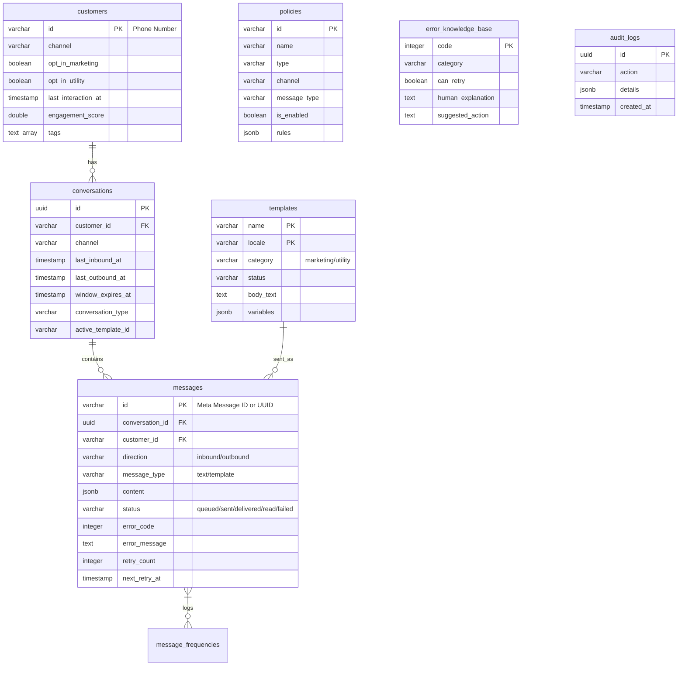

# Architectural Specifications

This document details the high-level system architecture, components integration, database schema, caching strategy, and queue topology of the Meta Business MCP platform.

## High-Level Architecture

The system is built as a single Go binary that operates in dual-mode:
1. **MCP Stdio Server**: Communicates with AI clients (like Gemini, Claude, Cursor) over standard input/output (stdin/stdout) using the Model Context Protocol.
2. **HTTP Server (Web server)**: Exposes endpoints for inbound Meta Webhooks, Prometheus Metrics, and Health Checks.

```
                      ┌───────────────────────────────┐
                      │           AI Agent            │
                      └──────────────┬────────────────┘
                                     │ Stdio (MCP Protocol)
                                     ▼
   ┌────────────────────────────────────────────────────────┐
   │                   Meta Business MCP                    │
   │                                                        │
   │   ┌───────────────────┐        ┌───────────────────┐   │
   │   │    MCP Server     ├───────►│ Compliance Engine │   │
   │   └───────────────────┘        └─────────┬─────────┘   │
   │                                          ▼             │
   │   ┌───────────────────┐        ┌───────────────────┐   │
   │   │ Webhook Receiver  │        │   Policy Engine   │   │
   │   └─────────▲─────────┘        └─────────┬─────────┘   │
   │             │                            ▼             │
   │             │                  ┌───────────────────┐   │
   │             │                  │    Orchestrator   │   │
   │             │                  └─────────┬─────────┘   │
   └─────────────┼────────────────────────────┼─────────────┘
                 │ Webhook                    │ POST /messages
                 │                            ▼
   ┌─────────────┴────────────────────────────┴─────────────┐
   │                 Meta Cloud API Mock                    │
   └────────────────────────────────────────────────────────┘
```

## Component Breakdown

- **Webhook Receiver**: Listens for POST webhooks from Meta, parsing inbound messages (which open/extend care windows) and status notifications (delivered, read, failed).
- **Compliance Engine**: Evaluates Meta Business rules including checking if the 24h care window is open, enforcing daily marketing frequency caps, and checking opt-out/opt-in status.
- **Policy Engine**: Evaluates database-backed business policies (e.g. time restrictions, timezone-specific rules, segment exclusions).
- **Delivery Orchestrator**: Enqueues messages to NATS JetStream and tracks delivery states.
- **Delivery Workers**: Background consumer pool that handles rate limiting, makes calls to Meta Cloud APIs, handles retry logic (backoff), and records audits.

---

## Caching Strategy

The system uses Redis to cache conversation states to achieve sub-millisecond latencies for compliance checks:
- **Cache Key**: `conv:<customer_id>:<channel>` (e.g. `conv:+12345678900:whatsapp`)
- **TTL**: Dynamically set to match the exact remaining duration of the 24-hour care window.
- **Graceful Fallback**: If Redis is offline, the state engine automatically queries PostgreSQL directly without throwing errors.

---

## Queue Topology

The platform integrates NATS JetStream configured with a **WorkQueue** retention policy (messages are removed from NATS once acknowledged by workers):

### 1. `META_MCP_DELIVERY` Stream
- **Subjects**: `whatsapp.messages.outbound`, `whatsapp.messages.retry`
- **Consumer**: Durable Pull Consumer (`delivery-workers`)
- **Max Deliver**: `3` attempts
- **Ack Wait**: `30s`
- **Backoff Delay**: Native exponential backoff (`NakWithDelay` at 1s, then 5s)

### 2. `META_MCP_CAMPAIGN` Stream
- **Subjects**: `whatsapp.campaigns.trigger`
- **Consumer**: `campaign-workers`

---

## Database Schema (PostgreSQL)

The relational schema is structured as follows:


